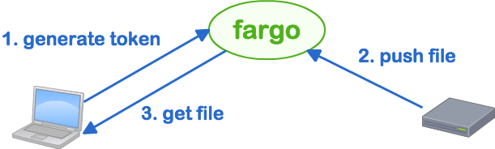

fargo
==================

[](https://app.wercker.com/project/bykey/4ffab3cbd879cf0d3a2f90cc15e6a0cd)

fargo(Fast cARGO) is simple file copy daemon with HTTP.



- Push/Get file with using ``TOKEN``
    - ``TOKEN`` automatically being invalid in 5 min
    - ``TOKEN`` can generate only from allowed IP Address (default: Private IP Addresses)
    - ``TOKEN`` require Basic Auth
- Pushed file automatically removed in 10 min

# Install

1. visit Latest release download page
    - [https://github.com/netmarkjp/fargo/releases/latest](https://github.com/netmarkjp/fargo/releases/latest)
2. download zip for your system
    - Linux x86_64 => ``linux_amd64.zip``
3. unzip downloaded file
    - ``unzip linux_amd64.zip``

# Usage

## Start server

```
./fargo
```

## Push file to server

1.get token(can access only from TOKEN_ALLOWED_FROM)

```
curl -v --user fargo:fargo http://fargo.example.com:1236/token
```

2.push file

```
curl -v -F file=@somefile http://fargo.example.com:1236/push/<TOKEN>
```

## Get file from server

```
curl -v -o somefile http://fargo.example.com:1236/get/<TOKEN>
```

or Latest curl(on MacOSX), can preserve original filename with ``-J`` option.

```
curl -v -OJ http://fargo.example.com:1236/get/<TOKEN>
```

# Help

```
curl http://fargo.example.com:1236/
```

or

```
curl http://fargo.example.com:1236/help
```

# Specification

- Listen address/port is ``0.0.0.0:1236`` by default.
    - can change with env ``FARGO_ADDR``
- ``/token`` can access from ``127.0.0.0/8,10.0.0.0/8,172.16.0.0/12,192.168.0.0/16``
    - can change with env ``TOKEN_ALLOWED_FROM``
- username/password for ``/token`` is ``fargo`` / ``fargo`` by default.
    - can change with env ``FARGO_USER`` and ``FARGO_PASSWORD``
- File store directory is ``/tmp`` by default.
    - can change with env ``STORE_DIR``
- ``TOKEN`` is UUIDv4
- ``TOKEN`` is expired in 5 min by default.
    - can change with env ``TOKEN_TTL`` (min)
- If get file fail, locked 30 seconds from same IP by default.
- Pushed file will delete in 600 sec(10 min) by default.
    - can change with env ``FILE_TTL`` (sec)

